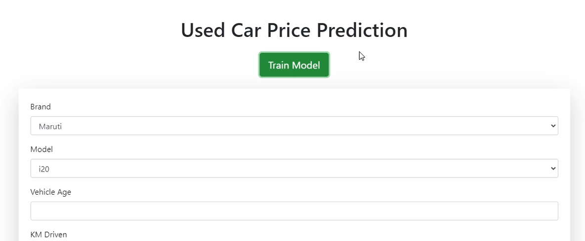
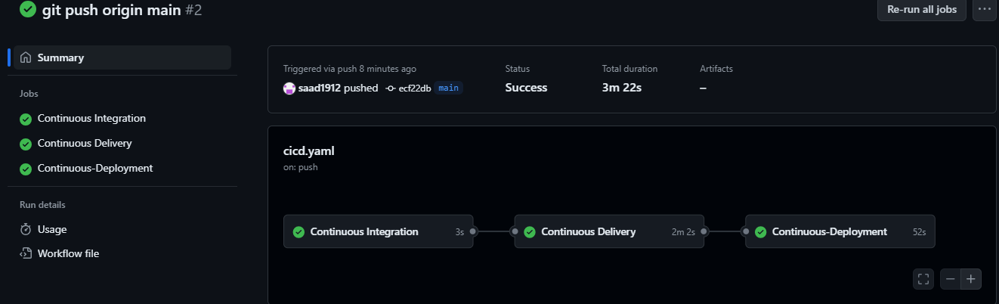

# Used_Car_Prediction_E2E 

## Video 

Here’s a video introduction to the project:-

[](https://drive.google.com/file/d/1FXFT_ooKv018iVQ6j_Gpnq62D6D5Ohc0/view?usp=drive_link)

# Github Actions (cicd.yaml)




## Workflows

1. update config.yaml
2. update schema.yaml
3. update params.yaml
4. update the entity
5. update the configuration manager in src config
6. update the components
7. update the pipeline
8. update the main.py
9. update the app.py


```bash
conda create -n mlproj python=3.8 -y
```

```bash
conda activate mlproj
```

```bash
pip install -r requirements.txt
```


```bash
python app.py
```

```bash
Open local host 0.0.0.0:8080
```


### ECR URI : 009160051451.dkr.ecr.ap-south-1.amazonaws.com/mlproject
### AWS EC2 link: http://13.233.102.49:8080/
